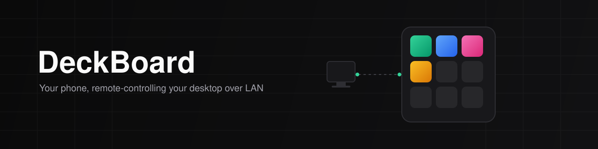
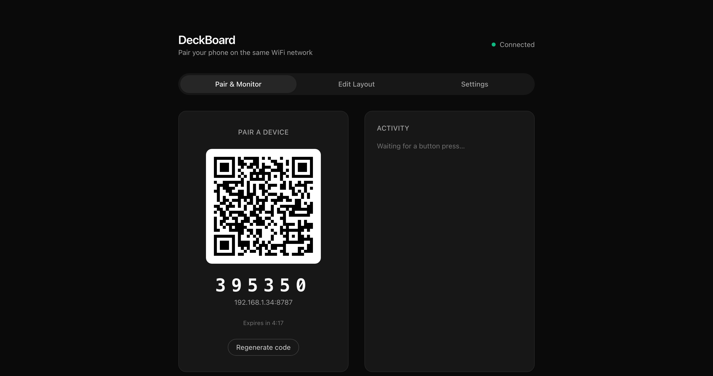
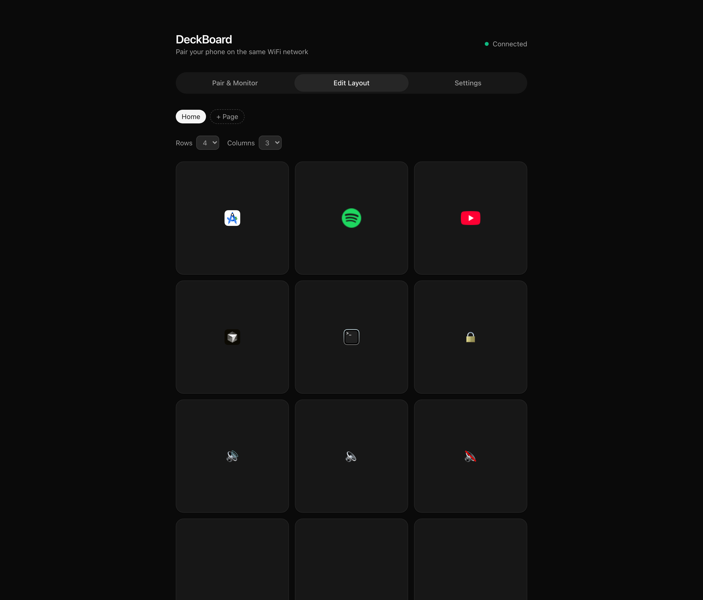
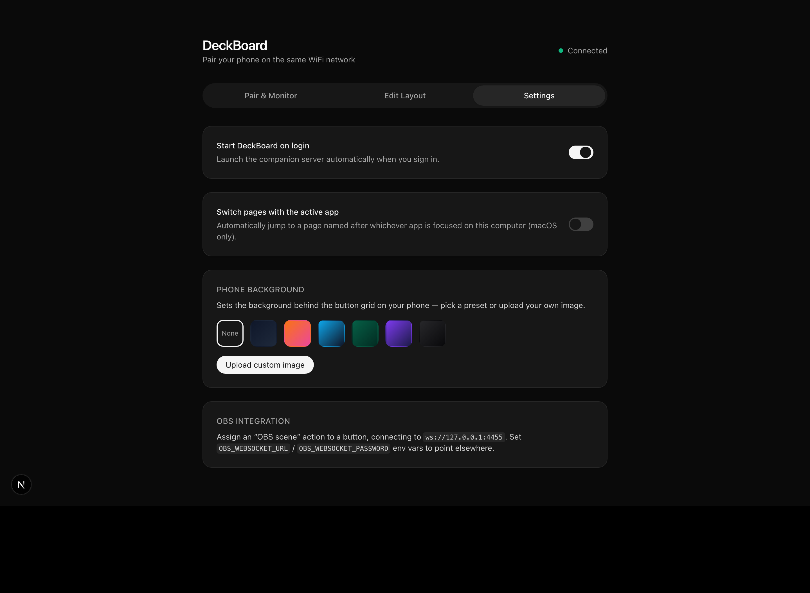

<div align="center">



### A self-hosted, LAN-only Stream Deck alternative
Turn your phone into a programmable macro pad for your desktop — no cloud, no subscription, no account.

[](https://www.typescriptlang.org/)
[](https://nodejs.org/)
[](https://nextjs.org/)
[](https://react.dev/)
[](https://kotlinlang.org/)
[](https://developer.android.com/jetpack/compose)
[](https://expressjs.com/)
[](https://github.com/websockets/ws)
[](https://tailwindcss.com/)
[](https://zod.dev/)

</div>

---

## What is DeckBoard?

DeckBoard turns an Android phone into a wireless macro pad for your computer — like an Elgato Stream Deck, but free, self-hosted, and entirely on your own WiFi network. A lightweight companion server runs on your PC; a Kotlin/Compose app on your phone connects to it over a WebSocket and shows a grid of customizable buttons. Every button press runs instantly on the desktop: open a URL or app, fire a keyboard shortcut, or switch an OBS scene.

No accounts, no telemetry, no internet dependency — pairing happens via a QR code or PIN shown on a local web dashboard, and everything stays on your LAN.

## Screenshots

<div align="center">

**Pair a device from the dashboard**


**Design the button grid — multiple pages, icons, actions**


**Configure server behavior from Settings**


</div>

## How it fits together

| Package | Stack | Role |
|---|---|---|
| [`server/`](server) | Node.js, TypeScript, Express, `ws` | Runs on your PC. Hosts the WebSocket the phone talks to, serves the dashboard, and executes button actions (shell commands, OBS control, app launches). |
| [`web/`](web) | Next.js 15, React 19, Tailwind CSS | The dashboard, served by the companion server. Handles pairing (QR/PIN), live activity monitoring, layout editing, and settings. Doesn't need to stay open for the phone to keep working. |
| [`android/`](android) | Kotlin, Jetpack Compose, OkHttp | The remote control surface — the button grid you actually tap. |
| [`shared/`](shared) | TypeScript, Zod | The message schema shared between `server` and `web`, validated at runtime. |
| [`docs/protocol.md`](docs/protocol.md) | — | Wire protocol spec — the source of truth for the Android client too. |

```
┌─────────────┐   WebSocket (LAN)   ┌──────────────────┐
│  Android app │◄───────────────────►│  Companion server │──── serves ───► Web dashboard
│ (Compose UI) │     button.press     │ (Node/Express/ws) │              (pairing + editor)
└─────────────┘   layout.snapshot    └──────────────────┘
                                              │
                                     runs actions locally:
                                URL/app launch · keyboard shortcut
                                    · OBS scene switch (obs-websocket)
```

## Features

- **Real actions** — buttons can open a URL/app, send a keyboard shortcut (macOS, via `osascript`), or switch an OBS scene via `obs-websocket-js`, all configured per-button from the dashboard.
- **Live layout editing** — the dashboard's "Edit Layout" tab manages multiple pages of a resizable button grid (label, emoji or custom icon, action), synced instantly to every connected phone via `layout.snapshot` / `layout.update`.
- **Polish** — Material 3 dynamic color, haptics + press-scale animation on tap, swipeable pages on Android.
- **Autostart & active-app profiles** — toggle "start on login" (`auto-launch`), or have the server auto-switch pages to match whichever app is frontmost on macOS (name a page after the app and it follows automatically).
- **Multi-device support** — several phones can connect to one server at once, backed by a concurrent-client-tested connection registry.
- **Reconnect-safe** — phones reconnect automatically after WiFi drops or app restarts, without re-pairing; server state (`devices.json`, `layout.json`) survives restarts.

## Getting started

```bash
npm install
npm run dev
```

This builds `shared`, then starts the companion server (`:8787`) and the dashboard dev server (`:3000`) together. The server prints its LAN IP, port, and current pairing PIN on startup.

The Android app is built and run separately in Android Studio (`android/`), on a device connected to the same WiFi network as your computer.

Optional configuration (OBS connection, port, active-app profiles) lives in `server/.env.example` — copy it to `server/.env` and adjust as needed.

## Manual QA

1. `npm run dev` — server logs LAN IP + port + PIN.
2. Open the dashboard in a browser — QR + PIN visible, empty event log.
3. On your phone (same WiFi), open the app and scan the QR (or enter host/PIN manually).
4. App goes Connecting → Paired → button grid; dashboard shows the device as connected.
5. In "Edit Layout", add a button action (e.g. Open URL) and save — the phone's grid updates live without reopening the app.
6. Tap that button — the dashboard's event log updates in real time, and the configured action runs on the PC.
7. Toggle phone WiFi off/on — app reconnects automatically, no re-pairing.
8. Force-close/reopen the app — resumes straight to the button grid.
9. Restart the server — phone resumes without re-pairing (state persisted under `server/data/`).

See [`docs/protocol.md`](docs/protocol.md) for the full wire format.
